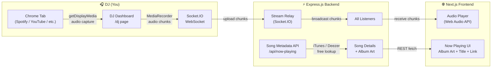
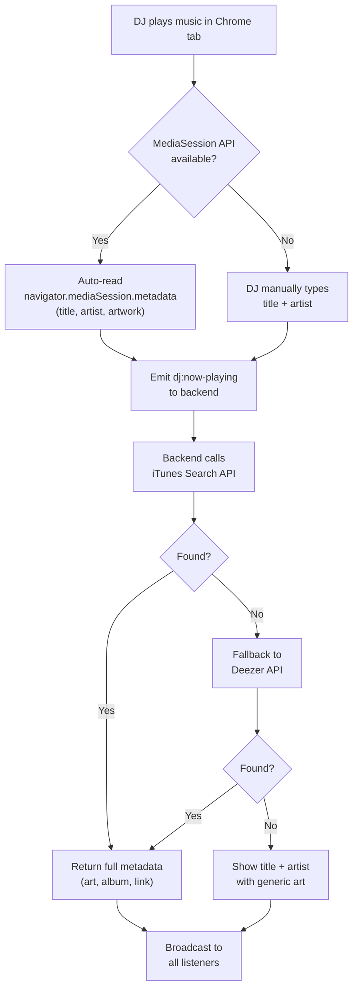

# Radio101 — Live Radio Streaming App

> **One-liner:** You play music in your Chrome tab → everyone on your website hears it live, with album art and song details.

---

## 1. High-Level Architecture



### How the Stream Works — Step by Step

1. **You (the DJ)** open `/dj` in Chrome and click "Start Broadcasting"
2. Browser calls `navigator.mediaDevices.getDisplayMedia({ audio: true })` — you pick the Chrome tab playing music
3. `MediaRecorder` encodes the tab audio into small chunks (webm/opus, ~250ms each)
4. Chunks are sent to the Express.js backend via **Socket.IO** in real time
5. Backend receives each chunk and **broadcasts** it to every connected listener
6. Listeners' browsers receive chunks and feed them into a **MediaSource** buffer for gapless playback
7. Meanwhile, the DJ dashboard reads `navigator.mediaSession.metadata` (or you type the song name) and sends **now-playing info** to the server
8. Backend calls the **iTunes Search API** (free, no key needed) to fetch album art, artist, and a link
9. Frontend displays the full now-playing card for all listeners

---

## 2. Tech Decisions

| Concern | Choice | Why |
|---|---|---|
| Real-time transport | **Socket.IO** | Handles reconnections, fallback to polling, room support |
| Audio capture | **getDisplayMedia** | Only reliable cross-browser way to capture tab audio |
| Audio encoding | **MediaRecorder (webm/opus)** | Native browser encoding, no extra libs |
| Audio playback | **MediaSource Extensions (MSE)** | Allows buffered, gapless streaming playback |
| Song metadata | **iTunes Search API** | 100% free, no API key, returns album art + preview links |
| Fallback metadata | **Deezer Search API** | Also free, no key, good international coverage |
| Styling | **Vanilla CSS** | Full control, premium dark-mode glassmorphism aesthetic |
| Font | **Google Fonts — Inter** | Clean, modern, highly readable |

---

## 3. Project File Structure

> All files below are relative to `radio101/`

```
radio101/
├── docs/
│   └── implementation_plan.md          ← this file
│
├── backend/
│   ├── package.json
│   ├── .env.example
│   ├── src/
│   │   ├── server.js                   ← Express + Socket.IO entry point
│   │   ├── config/
│   │   │   └── index.js                ← env vars, port, CORS origins
│   │   ├── routes/
│   │   │   └── nowPlaying.js           ← GET /api/now-playing
│   │   ├── services/
│   │   │   └── musicLookup.js          ← iTunes/Deezer API wrapper
│   │   └── socket/
│   │       └── streamHandler.js        ← Socket.IO event handlers
│   └── testing/
│       └── musicLookup.test.js         ← unit tests for API wrapper
│
├── frontend/
│   ├── package.json
│   ├── next.config.js
│   ├── public/
│   │   └── favicon.ico
│   ├── app/
│   │   ├── layout.js                   ← root layout (fonts, meta, global styles)
│   │   ├── page.js                     ← LISTENER page (main radio UI)
│   │   ├── globals.css                 ← design system / global styles
│   │   └── dj/
│   │       └── page.js                 ← DJ DASHBOARD (broadcast controls)
│   ├── components/
│   │   ├── NowPlaying.js               ← album art, song title, artist, link
│   │   ├── AudioPlayer.js              ← streaming audio playback engine
│   │   ├── Visualizer.js               ← audio waveform / bars animation
│   │   ├── ListenerCount.js            ← live listener count badge
│   │   └── DJControls.js               ← start/stop broadcast, song input
│   ├── hooks/
│   │   ├── useSocket.js                ← Socket.IO connection hook
│   │   └── useAudioStream.js           ← MediaSource playback hook
│   └── lib/
│       └── socket.js                   ← Socket.IO client singleton
│
└── README.md
```

---

## 4. Backend Detail

### 4.1 `server.js` — Entry Point

```
- Create Express app
- Attach Socket.IO with CORS configured for the Next.js frontend origin
- Mount REST routes: `/api/now-playing`
- Initialize Socket.IO event handlers from streamHandler.js
- Listen on PORT (default 3001)
```

### 4.2 `socket/streamHandler.js` — Stream Relay

**Events from DJ:**
| Event | Payload | Action |
|---|---|---|
| `dj:start` | `{ djSecret }` | Authenticate DJ, mark stream as live |
| `dj:audio-chunk` | `Buffer (webm/opus)` | Broadcast to all listeners in `radio` room |
| `dj:now-playing` | `{ title, artist }` | Store in memory, trigger metadata lookup, broadcast to listeners |
| `dj:stop` | — | Mark stream as offline, notify listeners |

**Events from Listeners:**
| Event | Payload | Action |
|---|---|---|
| `listener:join` | — | Join `radio` room, increment count, send current now-playing |
| `disconnect` | — | Decrement listener count |

**Broadcast Events (Server → Listeners):**
| Event | Payload |
|---|---|
| `stream:audio-chunk` | `Buffer` |
| `stream:now-playing` | `{ title, artist, album, albumArt, songUrl, source }` |
| `stream:status` | `{ live: boolean, listenerCount: number }` |

### 4.3 `services/musicLookup.js` — Song Metadata

```js
// Primary: iTunes Search API (free, no key)
// GET https://itunes.apple.com/search?term={artist}+{title}&media=music&limit=1
//
// Response provides:
//   - trackName, artistName, collectionName (album)
//   - artworkUrl100 (album art — replace "100x100" with "600x600" for HQ)
//   - trackViewUrl (link to Apple Music)
//
// Fallback: Deezer API (free, no key)
// GET https://api.deezer.com/search?q={artist}+{title}&limit=1
//
// Response provides:
//   - title, artist.name, album.title
//   - album.cover_xl (album art)
//   - link (Deezer track link)
```

### 4.4 `routes/nowPlaying.js` — REST Endpoint

```
GET /api/now-playing

Response: {
  live: true,
  title: "Blinding Lights",
  artist: "The Weeknd",
  album: "After Hours",
  albumArt: "https://...600x600.jpg",
  songUrl: "https://music.apple.com/...",
  listenerCount: 42
}
```

---

## 5. Frontend Detail

### 5.1 Listener Page (`app/page.js`)

The main page visitors see. Components:

1. **Header** — "Radio101" branding with live pulse indicator
2. **NowPlaying** — Large album art with glassmorphism card, song title, artist, album, and "Listen on Apple Music / Deezer" link
3. **AudioPlayer** — Play/pause button, volume slider, connection status
4. **Visualizer** — Animated audio bars or waveform (uses Web Audio API `AnalyserNode`)
5. **ListenerCount** — "🎧 42 listening now" badge with live updates

**Audio Playback Flow:**
```
Socket.IO receives `stream:audio-chunk` (Buffer)
  → Append to MediaSource SourceBuffer (webm/opus codec)
  → HTMLMediaElement plays the buffered stream
  → AnalyserNode feeds frequency data to Visualizer
```

### 5.2 DJ Dashboard (`app/dj/page.js`)

Private page for you (the broadcaster):

1. **Start/Stop Broadcast** button
   - Calls `getDisplayMedia({ audio: true, video: false })` on start
   - Creates `MediaRecorder` with `mimeType: 'audio/webm;codecs=opus'`
   - Every `ondataavailable` (250ms timeslice) → emit `dj:audio-chunk` via Socket.IO
2. **Now Playing Input** — Text fields for song title + artist (auto-detected from `navigator.mediaSession.metadata` if available, with manual override)
3. **Listener Count** display
4. **Stream Status** indicator (live / offline)

> **Note:** `getDisplayMedia` requires a user gesture (button click) and HTTPS in production. For local dev, `localhost` is allowed.

### 5.3 Key Hooks

#### `useSocket.js`
```
- Creates/reuses a Socket.IO client connection to the backend
- Handles connect/disconnect/reconnect events
- Returns: { socket, isConnected }
```

#### `useAudioStream.js`
```
- Creates MediaSource + SourceBuffer for 'audio/webm;codecs=opus'
- Listens for 'stream:audio-chunk' events
- Appends incoming buffers to the SourceBuffer
- Manages buffer cleanup (remove old segments to prevent memory leak)
- Connects an AnalyserNode for visualization
- Returns: { audioRef, isPlaying, play, pause, analyserNode }
```

---

## 6. Now-Playing Detection Strategy



> **Tip:** The **MediaSession API** works automatically when Spotify Web, YouTube Music, or most media players are active in Chrome. The DJ dashboard will poll `navigator.mediaSession.metadata` every 5 seconds and auto-update when the song changes.

---

## 7. UI/UX Design Spec

### 7.1 Design Language

| Property | Value |
|---|---|
| Theme | Dark mode, deep blacks + accent gradients |
| Primary BG | `#0a0a0f` (near-black) |
| Surface | `rgba(255, 255, 255, 0.04)` (glassmorphism panels) |
| Accent gradient | `linear-gradient(135deg, #6366f1, #a855f7, #ec4899)` (indigo → purple → pink) |
| Font | Inter (Google Fonts) 400/500/600/700 |
| Border radius | 16px for cards, 12px for buttons, 50% for avatars |
| Glassmorphism | `backdrop-filter: blur(20px); border: 1px solid rgba(255,255,255,0.08)` |
| Animations | Smooth 300ms transitions, pulse animation for live indicator, breathing glow on album art |

### 7.2 Listener Page Layout

```
┌─────────────────────────────────────────────────┐
│  🔴 LIVE    Radio101         🎧 42 listening    │  ← sticky header
├─────────────────────────────────────────────────┤
│                                                 │
│         ┌─────────────────────┐                 │
│         │                     │                 │
│         │    ALBUM ART        │                 │
│         │    (300×300)        │                 │
│         │    glow shadow      │                 │
│         └─────────────────────┘                 │
│                                                 │
│           Blinding Lights                       │  ← song title (large)
│           The Weeknd — After Hours              │  ← artist — album
│           🔗 Listen on Apple Music              │  ← external link
│                                                 │
│    ┌──────────────────────────────────────┐      │
│    │  ▶  ════════════●══════  🔊───●     │      │  ← play + volume
│    └──────────────────────────────────────┘      │
│                                                 │
│    ┌──────────────────────────────────────┐      │
│    │  │▎▌█▎▌▎│▌█▎▌▎│▎▌█▎▌▎│▌█▎▌▎│      │      │  ← audio visualizer
│    └──────────────────────────────────────┘      │
│                                                 │
│         Powered by Radio101 • Built with ♥      │  ← footer
└─────────────────────────────────────────────────┘
```

### 7.3 DJ Dashboard Layout

```
┌─────────────────────────────────────────────────┐
│  Radio101 DJ Dashboard           🎧 42 online   │
├─────────────────────────────────────────────────┤
│                                                 │
│  Stream Status: 🔴 LIVE (02:34:15)              │
│                                                 │
│  ┌─────────────────────────────┐                │
│  │   [ Stop Broadcasting ]     │                │
│  └─────────────────────────────┘                │
│                                                 │
│  Now Playing:                                   │
│  ┌─────────────────────────────┐                │
│  │ Title:  [Blinding Lights  ] │                │
│  │ Artist: [The Weeknd       ] │                │
│  │ [Auto-detect ON ✓]         │                │
│  └─────────────────────────────┘                │
│                                                 │
│  Audio Level: ▎▌█▎▌▎│▌█▎▌                      │
│                                                 │
└─────────────────────────────────────────────────┘
```

---

## 8. Security Considerations

| Concern | Solution |
|---|---|
| Only you can broadcast | DJ page requires a `DJ_SECRET` env variable. Socket `dj:start` event must include this secret. |
| No video capture | `getDisplayMedia` is called with `{ audio: true, video: false }` — no screen content is shared |
| CORS | Backend only accepts connections from the Next.js frontend origin |
| Rate limiting | Song metadata lookups are cached (in-memory, 5 min TTL) to avoid hammering iTunes API |
| HTTPS | Required in production for `getDisplayMedia` to work |

---

## 9. Environment Variables

### Backend `.env`
```env
PORT=3001
FRONTEND_ORIGIN=http://localhost:3000
DJ_SECRET=your-secret-passphrase-here
```

### Frontend `.env.local`
```env
NEXT_PUBLIC_BACKEND_URL=http://localhost:3001
NEXT_PUBLIC_DJ_SECRET=your-secret-passphrase-here
```

---

## 10. Dependencies

### Backend (`backend/package.json`)
```json
{
  "dependencies": {
    "express": "^4.18",
    "socket.io": "^4.7",
    "cors": "^2.8",
    "dotenv": "^16.3",
    "node-fetch": "^3.3"
  },
  "devDependencies": {
    "nodemon": "^3.0"
  }
}
```

### Frontend (`frontend/package.json`)
```json
{
  "dependencies": {
    "next": "^14.x",
    "react": "^18.x",
    "react-dom": "^18.x",
    "socket.io-client": "^4.7"
  }
}
```

---

## 11. Build Order (Phases)

### Phase 1 — Foundation & Streaming Core
> Get audio from your tab to a listener's browser

- [ ] Initialize backend with Express + Socket.IO
- [ ] Create `streamHandler.js` — DJ events, audio relay, listener rooms
- [ ] Initialize Next.js frontend
- [ ] Create DJ Dashboard with `getDisplayMedia` capture + MediaRecorder
- [ ] Create `useAudioStream` hook — MediaSource playback
- [ ] Create Listener page with basic audio playback
- [ ] **Verify:** DJ can broadcast tab audio → listener hears it

### Phase 2 — Now Playing & Song Metadata
> Show what song is playing with album art and details

- [ ] Create `musicLookup.js` — iTunes + Deezer API wrapper
- [ ] Create `nowPlaying.js` route — REST endpoint
- [ ] Add MediaSession metadata auto-detection on DJ page
- [ ] Create `NowPlaying.js` component — album art, title, artist, link
- [ ] Wire up Socket.IO `stream:now-playing` events
- [ ] **Verify:** Song info auto-updates when DJ changes tracks

### Phase 3 — Premium UI & Polish
> Make it look stunning

- [ ] Design system in `globals.css` — dark theme, glassmorphism, gradients
- [ ] Animated audio visualizer (`Visualizer.js`)
- [ ] Live pulse indicator + listener count badge
- [ ] Responsive design (mobile + desktop)
- [ ] Smooth micro-animations and hover effects
- [ ] **Verify:** UI looks premium across devices

### Phase 4 — Hardening & Deployment
> Production-ready

- [ ] DJ authentication with `DJ_SECRET`
- [ ] CORS lockdown
- [ ] Metadata caching (in-memory TTL)
- [ ] Error handling & reconnection logic
- [ ] README with setup instructions
- [ ] **Verify:** Full end-to-end test, deploy to hosting

---

## 12. Verification Plan

### Automated
- Unit test `musicLookup.js` — mock iTunes/Deezer responses
- Integration test Socket.IO events using `socket.io-client` in tests

### Manual / Browser
- Open DJ Dashboard → click Start Broadcasting → select a Chrome tab playing Spotify
- Open Listener page in a second browser/incognito → confirm audio plays within ~1-2 seconds
- Change song on Spotify → confirm Now Playing card updates with correct album art + details
- Check listener count updates in real time
- Test on mobile viewport for responsive layout

---

## Open Questions

1. **DJ Authentication:** The current plan uses a simple shared secret (`DJ_SECRET`). Do you want a proper login page for the DJ, or is the secret approach fine?

2. **Hosting:** Where do you plan to deploy? (e.g., Vercel for frontend + Railway/Render for backend, or a single VPS?) This affects the Socket.IO transport config.

3. **Song Detection:** The `MediaSession API` works great with Spotify Web Player and YouTube Music, but may not work with all sources. The manual title/artist input is the fallback. Is auto-detect + manual override acceptable?
